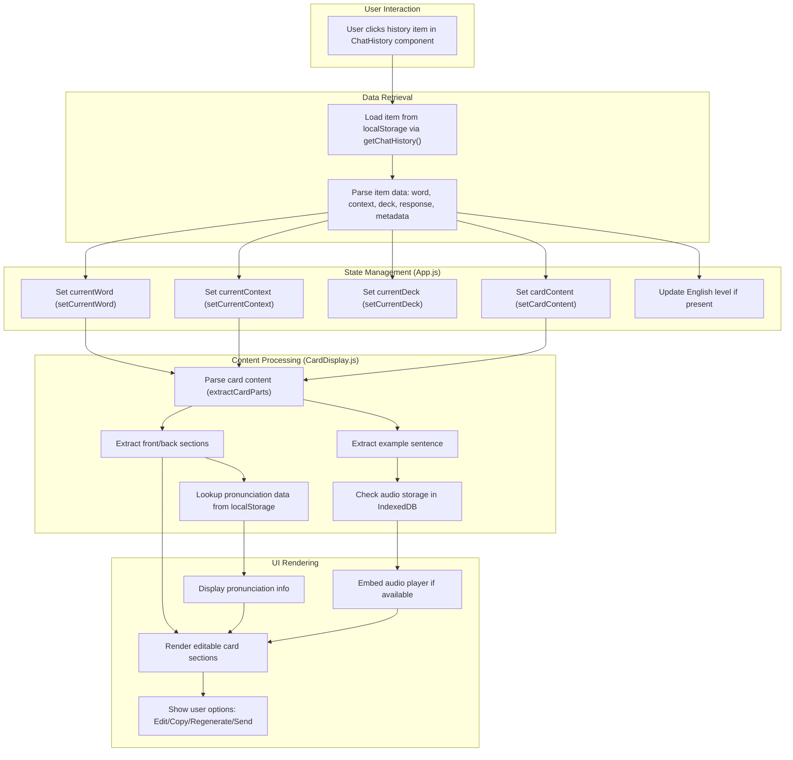

# History Card Opening Data Flow

```mermaid
flowchart TD
    subgraph UserInteraction["User Interaction"]
        A["User clicks history item in ChatHistory component"]
    end

    subgraph DataRetrieval["Data Retrieval"]
        B["Load item from localStorage via getChatHistory()"]
        C["Parse item data: word, context, deck, response, metadata"]
    end

    subgraph StateManagement["State Management (App.js)"]
        D["Set currentWord (setCurrentWord)"]
        E["Set currentContext (setCurrentContext)"]
        F["Set currentDeck (setCurrentDeck)"]
        G["Set cardContent (setCardContent)"]
        H["Update English level if present"]
    end

    subgraph ContentProcessing["Content Processing (CardDisplay.js)"]
        I["Parse card content (extractCardParts)"]
        J["Extract front/back sections"]
        K["Extract example sentence"]
        L["Lookup pronunciation data from localStorage"]
        M["Check audio storage in IndexedDB"]
    end

    subgraph UIRendering["UI Rendering"]
        N["Render editable card sections"]
        O["Display pronunciation info"]
        P["Embed audio player if available"]
        Q["Show user options: Edit/Copy/Regenerate/Send"]
    end

    A --> B
    B --> C
    C --> D
    C --> E
    C --> F
    C --> G
    C --> H
    
    D --> I
    E --> I
    G --> I
    
    I --> J
    I --> K
    J --> L
    K --> M
    
    J --> N
    L --> O --> N
    M --> P --> N
    
    N --> Q
```
