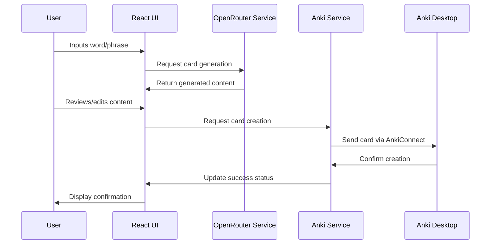
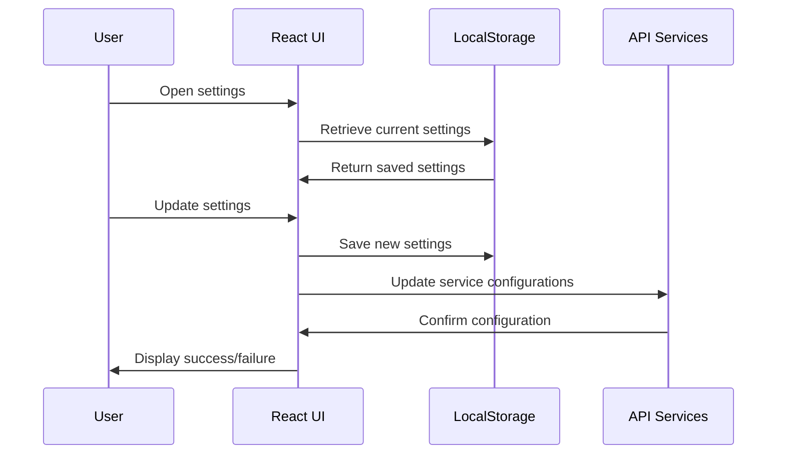

# Anki Card Generator - System Patterns

## Architecture Overview

The Anki Card Generator follows a component-based architecture typical of React applications with clear separation of concerns:

```
┌─────────────────────────────────────────────────────┐
│                  React Application                   │
│                                                     │
│  ┌─────────────┐   ┌──────────────┐  ┌───────────┐  │
│  │  Components │   │   Services   │  │  Utilities │  │
│  └─────────────┘   └──────────────┘  └───────────┘  │
│         │                │                 │        │
└─────────┼────────────────┼─────────────────┼────────┘
          │                │                 │
          ▼                ▼                 ▼
    User Interface    External APIs    Helper Functions
```

## Design Patterns

### Service Pattern
The application uses a service-oriented approach to separate API communication from UI logic:
- `AnkiService.js` encapsulates all Anki API operations
- `OpenRouterService.js` handles AI service communications

This allows for:
- Easier testing and mocking of external services
- Centralized error handling for API interactions
- Potential to swap out service implementations without changing UI components

### Component Composition
UI elements are composed of reusable React components that encapsulate specific functionalities:
- Modal components for configuration (`APIKeyModal.js`, `CreateCardModal.js`)
- Form components for data input (`WordForm.js`)
- Display components for output (`CardDisplay.js`)

### State Management
Based on the project structure, the application likely uses:
- React's built-in state management for component-level state
- Possibly some form of context or prop-drilling for cross-component state
- LocalStorage for persistent state (`localStorage.js` utility)

## Communication Flows

### Card Creation Flow


### Configuration Flow


## Error Handling

Based on the existence of CORS-FIX.md and other documentation, the application likely implements:
- Graceful handling of Anki connection issues
- API key validation and authentication error handling
- Network error recovery strategies

## Component Relationships

```
┌──────────────┐     ┌───────────────┐
│   App.js     │────▶│ WordForm.js   │
└──────────────┘     └───────────────┘
       │                    │
       │                    ▼
       │             ┌───────────────┐
       │             │OpenRouterService│
       │             └───────────────┘
       │                    │
       ▼                    ▼
┌──────────────┐     ┌───────────────┐
│DeckSelector.js│    │ CardDisplay.js │
└──────────────┘     └───────────────┘
       │                    │
       ▼                    ▼
┌──────────────┐     ┌───────────────┐
│ AnkiService.js│◀───│CreateCardModal.js│
└──────────────┘     └───────────────┘
```

## Security Patterns

- API keys stored in localStorage (encrypted or hashed if sensitive)
- No server-side persistence of user data
- Potential use of proxies to avoid exposing direct API connections

## Performance Considerations

- Asynchronous API calls to prevent UI blocking
- Potential caching of previously generated cards
- Optimistic UI updates to improve perceived performance
