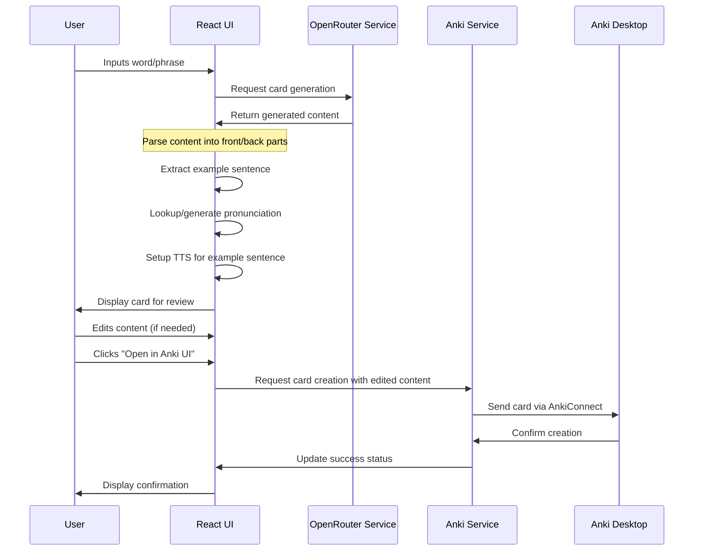
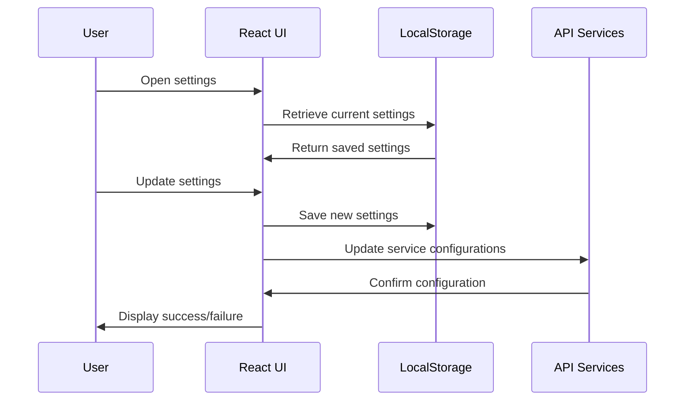

# Anki Card Generator - System Patterns

## Architecture Overview

The Anki Card Generator follows a component-based architecture typical of React applications with clear separation of concerns:

```
┌─────────────────────────────────────────────────────┐
│                  React Application                   │
│                                                     │
│  ┌─────────────┐   ┌──────────────┐  ┌───────────┐  │
│  │  Components │   │   Services   │  │  Utilities │  │
│  └─────────────┘   └──────────────┘  └───────────┘  │
│         │                │                 │        │
└─────────┼────────────────┼─────────────────┼────────┘
          │                │                 │
          ▼                ▼                 ▼
    User Interface    External APIs    Helper Functions
```

## Design Patterns

### Service Pattern
The application uses a service-oriented approach to separate API communication from UI logic:
- `AnkiService.js` encapsulates all Anki API operations
- `OpenRouterService.js` handles AI service communications

This allows for:
- Easier testing and mocking of external services
- Centralized error handling for API interactions
- Potential to swap out service implementations without changing UI components

### Component Composition
UI elements are composed of reusable React components that encapsulate specific functionalities:
- Modal components for configuration (`APIKeyModal.js`, `CreateCardModal.js`)
- Form components for data input (`WordForm.js`)
- Display components for output (`CardDisplay.js`)
- Supporting components for enhanced functionality:
  - `ExampleSentenceAudio.jsx`: Audio playback for example sentences
  - `PronunciationPreview`: Display and playback of word pronunciations
  - Utility components like `AutosizeTextarea` for improved editing experience

### Card Component Structure
The `CardDisplay.js` component demonstrates a complex composition pattern:
- Main container for card content
- Separate sections for front and back content
- Embedded markdown rendering with syntax highlighting
- Inline editing capabilities with automatic resizing
- Audio integration for both pronunciation and example sentences

### State Management
The application uses:
- React's built-in state management with hooks for component-level state:
  - `useState` for UI state (editing modes, display text)
  - `useEffect` for side effects (content parsing, audio setup)
  - `useRef` for DOM references (textarea auto-resizing)
- LocalStorage for persistent data (`localStorage.js` utility):
  - OpenRouter API key storage
  - Chat history with timestamps and IDs
  - User preferences (deck selection, native language, English level)
  - Dictionary data and pronunciation information
  - Example sentences and their text-based metadata
  - References to audio files
- IndexedDB for binary data storage (`AudioDBService.js`):
  - TTS audio blobs stored by sentence text
  - Indexed by cardId, createdAt, and text content
  - Automatic cleanup of old audio files
- Component prop passing for cross-component communication

## Communication Flows

The history card opening process is documented in [history-card-flow.md](./history-card-flow.md) with a detailed flowchart showing:
- User interaction with history items
- Data retrieval from localStorage
- State management flow
- Content processing steps
- UI rendering sequence

### Card Creation Flow


### Card Rendering Flow
```mermaid
flowchart TD
    Input["AI Generated Content"] --> Parser["extractCardParts()"]
    Parser --> FrontContent["Front Content"]
    Parser --> BackContent["Back Content"]
    
    FrontContent --> FrontEditor["Front Editor/Viewer"]
    BackContent --> BackEditor["Back Editor/Viewer"]
    
    FrontContent --> WordExtractor["Extract Bold Word"]
    WordExtractor --> PronunciationLookup["Lookup Pronunciation"]
    
    Input --> SentenceExtractor["Extract Example Sentence"]
    SentenceExtractor --> AudioLookup["Lookup/Generate TTS Audio"]
    
    FrontEditor --> CardPreview["Card Preview"]
    BackEditor --> CardPreview
    PronunciationLookup --> CardPreview
    AudioLookup --> CardPreview
    
    CardPreview --> UserActions["User Actions
    (Edit, Copy, Regenerate, Send to Anki)"]
    
    UserActions --> UpdatedContent["Updated Card Content"]
    UpdatedContent --> AnkiExport["Export to Anki"]
    
### History Card Opening Flow
```mermaid
flowchart TD
    subgraph UserAction["User Action"]
        A[User clicks on history item]
    end

    subgraph StorageRetrieval["Storage Retrieval"]
        B[Load from localStorage]
        C[Item: {word, context, deck, response, metadata}]
    end

    subgraph StateUpdate["App State"]
        D[Set currentWord]
        E[Set currentContext] 
        F[Set currentDeck]
        G[Set cardContent]
        H[Update English level if needed]
    end

    subgraph ContentProcessing["Content Processing"]
        I[Parse front/back sections]
        J[Extract example sentence]
        K[Lookup pronunciation data]
        L[Check audio storage]
    end

    subgraph UIDisplay["UI Display"]
        M[Render editable card]
        N[Show pronunciation info]
        O[Embed audio player if available]
    end

    A --> B --> C
    C --> D --> I
    C --> E --> I
    C --> F --> I
    C --> G --> I
    C --> H
    
    I --> J --> L
    I --> K --> N
    J --> L --> O
    
    I --> M
    N --> M
    O --> M
    
    M --> P{User Options}
    P --> Q[Edit]
    P --> R[Copy]
    P --> S[Regenerate]
    P --> T[Send to Anki]
```

### Configuration Flow


## Error Handling

Based on the existence of CORS-FIX.md and other documentation, the application likely implements:
- Graceful handling of Anki connection issues
- API key validation and authentication error handling
- Network error recovery strategies

## Component Relationships

```
┌──────────────┐     ┌───────────────┐
│   App.js     │────▶│ WordForm.js   │
└──────────────┘     └───────────────┘
       │                    │
       │                    ▼
       │             ┌───────────────┐
       │             │OpenRouterService│
       │             └───────────────┘
       │                    │
       ▼                    ▼
┌──────────────┐     ┌───────────────┐
│DeckSelector.js│    │ CardDisplay.js │
└──────────────┘     └───────────────┘
       │                    │
       │                    ├───────────▶┌─────────────────────┐
       │                    │            │ExampleSentenceAudio.jsx│
       │                    │            └─────────────────────┘
       │                    │
       │                    ├───────────▶┌─────────────────────┐
       │                    │            │PronunciationPreview │
       │                    │            └─────────────────────┘
       │                    │
       ▼                    ▼
┌──────────────┐     ┌───────────────┐
│ AnkiService.js│◀───│CreateCardModal.js│
└──────────────┘     └───────────────┘
       │
       ▼
┌──────────────┐
│ TtsService.js│
└──────────────┘
```

## Content Parsing and Formatting

### Card Content Parsing Pattern
The application uses a specific pattern for extracting card content:
- Front part delimited by `==front part==` markers
- Back part delimited by `==bottom part==` markers 
- Example sentences extracted using regex patterns
- Bold words identified for pronunciation lookup

### Markdown Rendering
- Uses `ReactMarkdown` for rendering content with rich formatting
- `SyntaxHighlighter` for code blocks with syntax highlighting
- Custom component composition for specialized rendering

## Data Storage Patterns

### LocalStorage Pattern
The application uses a structured approach to localStorage:
- Helper utilities (`getLocalStorageItem`, `setLocalStorageItem`) for consistent access
- Automatic JSON parsing/stringification for object storage
- Specific keys for different data types (API keys, history, preferences)
- Direct key-value approach for simple data
- Chat history entries include timestamps and unique IDs

### IndexedDB Pattern for Audio Data
The application uses IndexedDB specifically for audio data:
- Singleton service pattern (`AudioDBService`)
- Database initialization with versioning support
- Indexes for efficient querying (by cardId, creation date, text)
- Text normalization for reliable key generation
- Blob storage for binary audio data
- Age-based cleanup to prevent excessive storage usage

## Audio Integration Patterns

### Pronunciation Audio
- Dictionary-based audio URLs for word pronunciations
- Separate US and UK pronunciation variants
- Audio playback controls for each variant
- Reference storage in localStorage (URLs only)

### Example Sentence TTS
- Text-to-speech generation for example sentences
- Binary audio data stored in IndexedDB as Blobs
- Text content used as normalized keys for storage/retrieval
- Audio preview directly in the card display via blob URLs
- Audio files attached to Anki cards
- Caching system to avoid redundant TTS generation

## Security Patterns

- API keys stored in localStorage (encrypted or hashed if sensitive)
- No server-side persistence of user data
- Potential use of proxies to avoid exposing direct API connections
- Audio data managed with blob URLs for current session security

## Performance Considerations

- Asynchronous API calls to prevent UI blocking
- Potential caching of previously generated cards
- Optimistic UI updates to improve perceived performance
- LocalStorage for caching pronunciation and TTS data
- Audio data management with blob URLs for efficient playback
- Auto-resizing textareas for improved editing experience
